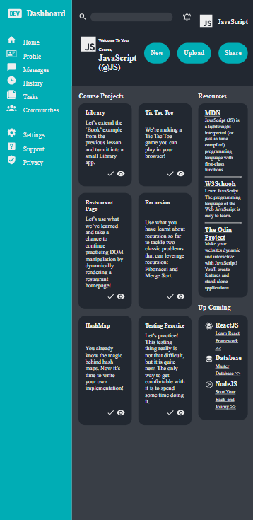

# 📊 JavaScript Course Dashboard

A sleek, modern dashboard interface for tracking The Odin Project's JavaScript curriculum progress. Built with pure HTML and CSS as part of the Intermediate HTML/CSS course.

## Screen Shots Preview
## Desktop View:

## Mobile View:

## 🎮 Live Preview

**Live Demo:** [JS Project Tracker](https://ah0m0ed.github.io/TOP_admin-dashboard/).

## 🎯 Project Overview

This is a **static design prototype** of a comprehensive course tracking dashboard. It features a modern dark theme with intuitive navigation and organized content sections for managing JavaScript learning progress.

## ✨ Features

- **Modern Dark Theme** - Easy-on-the-eyes color scheme perfect for developers
- **Responsive Layout** - CSS Grid and Flexbox based responsive design
- **Project Tracking** - Visual project cards with completion status
- **Interactive Elements** - Search bar and navigation icons
- **Resource Hub** - Quick access to learning resources
- **Progress Visualization** - Clean status indicators for course projects

## 🧱 Project Structure

├── index.html # Main HTML file (structure & content)\
├── style.css # Styling and layout definitions\
├── img/ # Folder containing icons and SVGs\
│ ├── logo.svg\
│ ├── search.svg\
│ ├── notify.svg\
│ ├── js.svg\
│ ├── ...etc\
└── fonts/\
├── Roboto-Regular.woff2\
├── Roboto-Bold.woff2\
├── Roboto-ExtraLight.woff2

## 🧩 Customization

- To change the course name or profile info, edit the header-bottom section inside index.html.

- To add new projects or resources, duplicate the 
 elements inside their respective containers.

- Icons can be replaced in the img/ folder — just ensure filenames match.

## 🧠 Inspiration

This project is inspired by The Odin Project’s JavaScript Path, designed to help learners build hands-on dashboard UIs while practicing CSS Grid and Flexbox.
