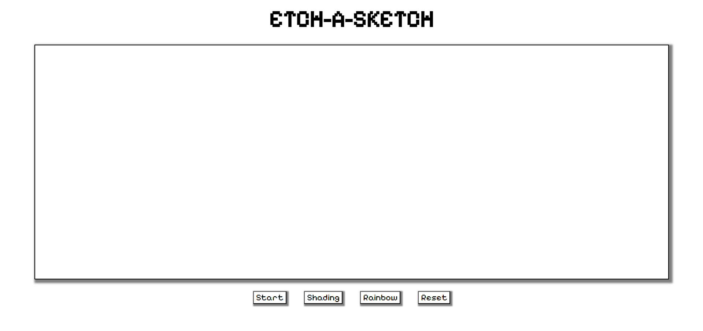

## Etch-A-Sketch Web App
A browser-based implementation of the classic Etch-A-Sketch drawing toy, built with vanilla JavaScript, HTML, and CSS as part of The Odin Project curriculum.

# Project preview

# 🎨 Features
-  **Dynamic Grid System:** - Create custom grids from 2x2 to 100x100

- **Multiple Drawing Modes:**

    - **Shading Mode:** - Progressive darkening with each interaction (10% increments)

    - **Rainbow Mode:** - Random colors for vibrant artwork

- **Interactive Controls:**

    - Create/Reset grid

    - Switch between drawing modes

    - Real-time button state indicators

- **Responsive Design:** -Works on various screen sizes

# 🚀 Live Demo
View Live Project (https://ah0m0ed.github.io/TOP_etch-a-sketch/)

# 🛠️ Technologies Used

- **HTML5:** - Semantic structure and accessibility

- **CSS3:** - Flexbox, transitions, and hover effects

- **JavaScript (ES6+):** - DOM manipulation, event handling, and dynamic grid generation

# 📁 Project Structure
etch-a-sketch\
├── index.html          # Main HTML file\
├── style.css           # Styles and layout\
├── script.js           # JavaScript functionality\
├── PixelifySans-Regular.woff2 # Font file\
└── README.md           # Project documentation

# 🎯 How to Use

1. **Create a Grid:** - Click "Start" and enter a number between 2-100

2. **Start Drawing:** - Hover over the grid squares to draw

3. **Switch Modes:**

    - **Shading:** - Progressive darkening effect

    - **Rainbow:** - Random color generator

4. **Reset:** - Clear your artwork and start fresh

5. **New Grid:** - Create a different sized grid at any time

# 🎓 Learning Outcomes
**This project demonstrates:-**

- DOM manipulation and dynamic element creation

- Event handling and delegation

- CSS Flexbox for layout

- JavaScript functions and control flow

- User input validation

- Code organization and separation of concerns

